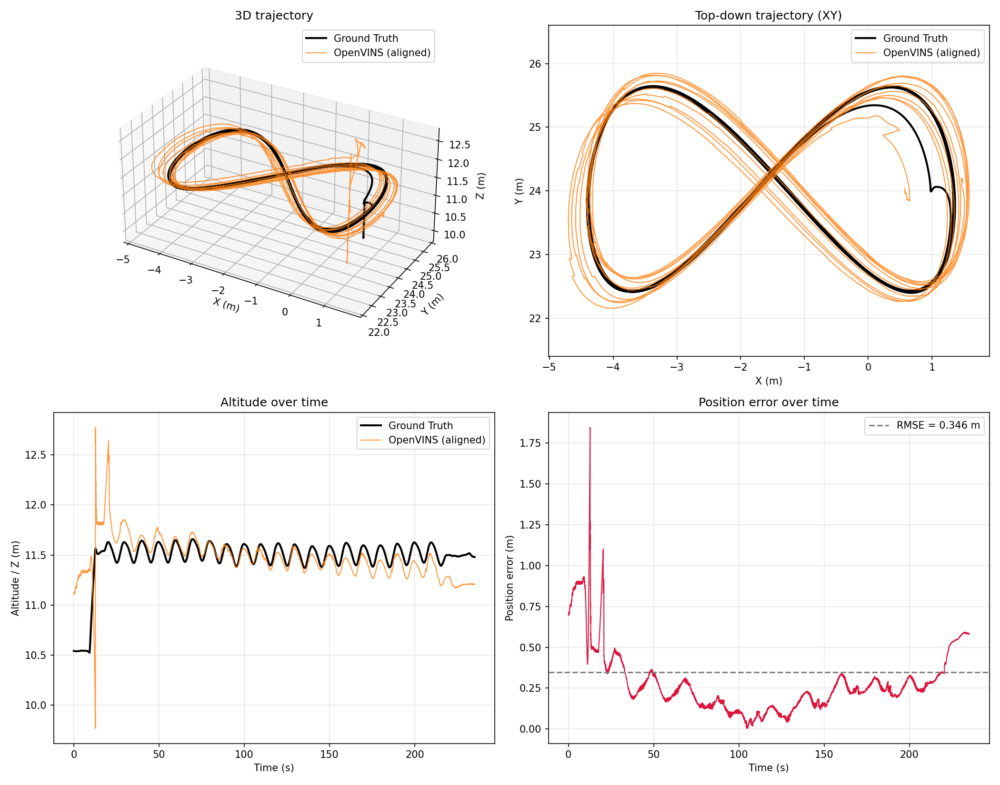

# vo_eval_tools

Automated OpenVINS accuracy evaluation: flies `px4vision_custom_0` through a
scripted figure-8 for a configurable number of loops (default 10) via PX4
offboard mode, records `/odomimu` (OpenVINS estimate) and
`/px4vision_custom_0/odometry` (Gazebo ground truth) to a rosbag, converts
both to TUM-format trajectory files, and runs OpenVINS' own `vo_eval`
package (`error_singlerun`) to compute ATE/RPE.

## Preview

Example `trajectory_plot.png` output from `run_evaluation` (`align_mode=se3`) —
estimated trajectory (orange) vs. ground truth (black) over a figure-8, with
altitude and position-error-over-time panels:



## Prerequisites

The Gazebo/PX4 sim stack, mavros, and OpenVINS must already be running
before you launch this package - it does not start any of them. In
practice this means, in separate terminals:

1. The sim stack (however you normally start it, e.g. the tmux-based
   `start-sim-composition.sh`, or a direct `ros2 launch px4_gazebo_sim
   launch-sim.launch.py ...`).
2. `ros2 launch ov_msckf cf_sim_launch.py`

## Running an evaluation

```bash
colcon build --packages-select vo_eval_tools
source install/setup.bash

ros2 launch vo_eval_tools figure8_eval.launch.py
```

Each run gets its own timestamped folder under `runs_root` (default:
`<this workspace>/vo_eval_runs`, resolved from `COLCON_PREFIX_PATH` - no
hardcoded path). Override it with:

```bash
ros2 launch vo_eval_tools figure8_eval.launch.py runs_root:=/path/to/put/runs
```

Watch the console (or `ros2 topic echo /figure8_offboard_controller/status`)
for state transitions. The flight sequence is: wait for FCU connection ->
wait for a pose -> stream hold-position setpoints -> engage OFFBOARD + arm
-> climb -> stabilize -> fly the figure-8 for `num_loops` loops -> hold
position and report `COMPLETE`.

The controller does **not** land or disarm automatically (unless you set
`land_after_completion:=true`) - once you see `COMPLETE`, `Ctrl+C` the
launch to stop the recording.

Then evaluate the recorded bag:

```bash
ros2 run vo_eval_tools run_evaluation --bag /home/ros2_ws/vo_eval_runs/<timestamp>
```

This prints ATE (position/orientation RMSE) and RPE (at the 5 segment
lengths `ov_eval` hardcodes: 8/16/24/32/40m) and saves the full output to
`<bag_dir>/results.txt`.

## Tuning the figure-8

Edit `config/figure8_params.yaml` (or override via `ros2 launch
vo_eval_tools figure8_eval.launch.py config:=/path/to/your.yaml`). Key
parameters:

| param | meaning |
|---|---|
| `half_length_m` / `half_width_m` | figure-8 extent in meters |
| `loop_period_s` | seconds per lap |
| `num_loops` | how many laps before holding |
| `climb_height_m` | altitude gained above wherever the vehicle is when the controller starts (not an absolute world altitude) |

The figure-8 is always centered on the vehicle's actual position at
startup, not on any assumed absolute spawn coordinate - so it's safe to run
regardless of which world/spawn pose is currently active. Check the
analytic max-speed line the controller logs at startup against your room
size before increasing the amplitude or shortening `loop_period_s`.

## Manual conversion only

If you just want the TUM files without running `error_singlerun`:

```bash
ros2 run vo_eval_tools bag_to_tum --bag /home/ros2_ws/vo_eval_runs/<timestamp>
```
